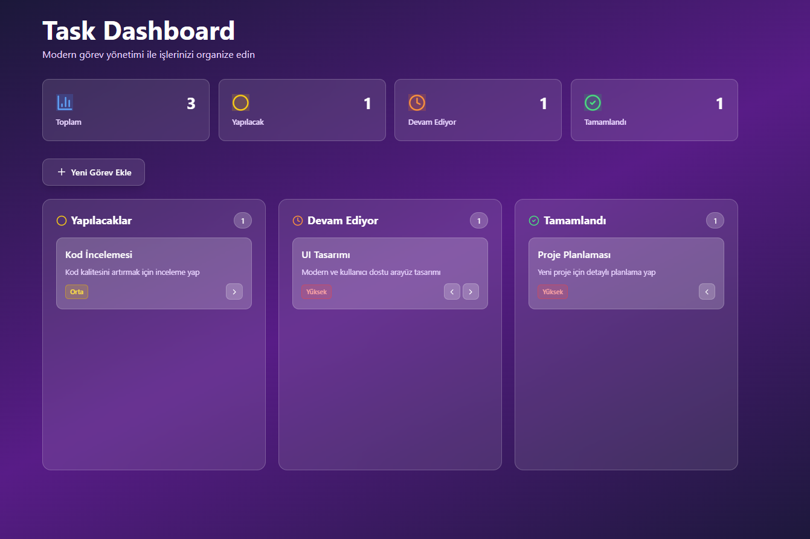
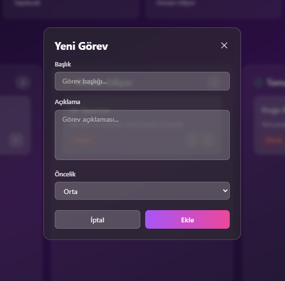

# 📋 Task Dashboard - Modern Task Management

Modern ve kullanıcı dostu bir görev yönetim uygulaması. React, TypeScript ve Tailwind CSS ile geliştirilmiştir.


## 📸 Ekran Görüntüleri

### Ana Dashboard



### Görev Yönetimi



## 🚀 Özellikler

- ✨ **Modern ve Responsive Tasarım** - Tüm cihazlarda mükemmel görünüm
- 📊 **İstatistik Dashboard'u** - Toplam, yapılacak, devam eden ve tamamlanan görev istatistikleri
- 🎯 **Görev Durumu Yönetimi** - Yapılacak, Devam Ediyor, Tamamlandı durumları
- 🏷️ **Öncelik Seviyeleri** - Düşük, Orta, Yüksek öncelik seçenekleri
- 🎨 **Glassmorphism UI Tasarımı** - Modern cam efekti tasarım
- ⚡ **Hızlı ve Performanslı** - Vite ile optimize edilmiş build
- 📱 **Mobil Uyumlu** - Responsive grid layout ile mobil deneyim
- 🎭 **Animasyonlar** - Smooth geçişler ve hover efektleri
- 💾 **Context API** - State yönetimi için React Context
- 🔍 **TypeScript Desteği** - Tip güvenliği ile daha güvenli kod

## 🛠️ Teknolojiler

- **React 18** - Modern UI kütüphanesi
- **TypeScript** - Tip güvenliği ve daha iyi geliştirme deneyimi
- **Tailwind CSS** - Utility-first CSS framework
- **Vite** - Hızlı build tool ve geliştirme sunucusu
- **Lucide React** - Modern ikon kütüphanesi
- **Context API** - State yönetimi
- **PostCSS** - CSS işleme
- **Autoprefixer** - Otomatik vendor prefix'leri

## 📋 Gereksinimler

- Node.js (v16 veya üzeri önerilir)
- npm veya yarn
- Modern bir web tarayıcısı

> 💡 **Not:** Node.js kurulumu için detaylı bilgi için [KURULUM.md](./KURULUM.md) dosyasına bakabilirsiniz.

## 📦 Kurulum

### 1. Projeyi Klonlayın

```bash
git clone <repository-url>
cd task-dashboard
```

### 2. Bağımlılıkları Yükleyin

```bash
npm install
```

### 3. Geliştirme Sunucusunu Başlatın

```bash
npm run dev
```

Uygulama `http://localhost:5173` adresinde çalışacaktır.

### 4. Production Build

```bash
npm run build
```

Build dosyaları `dist` klasörüne oluşturulacaktır.

### 5. Production Preview

```bash
npm run preview
```

## 🎯 Kullanım

### Yeni Görev Ekleme

1. Ana ekrandaki **"Yeni Görev Ekle"** butonuna tıklayın
2. Görev başlığını girin
3. Görev açıklamasını yazın (isteğe bağlı)
4. Öncelik seviyesini seçin (Düşük, Orta, Yüksek)
5. **"Görev Ekle"** butonuna tıklayın

### Görev Durumu Değiştirme

- Görev kartındaki **ok butonları** ile görevleri bir sonraki veya önceki duruma taşıyın
- Görevler otomatik olarak ilgili sütuna taşınacaktır

### Görev Silme

- Görev kartının üzerine gelin
- **Çöp kutusu ikonuna** tıklayın
- Görev kalıcı olarak silinecektir

### İstatistikleri Görüntüleme

- Dashboard üst kısmında toplam, yapılacak, devam eden ve tamamlanan görev sayılarını görüntüleyin
- İstatistikler gerçek zamanlı olarak güncellenir

## 📁 Proje Yapısı

```
task-dashboard/
├── src/
│   ├── components/          # React bileşenleri
│   │   ├── Dashboard.tsx    # Ana dashboard bileşeni
│   │   ├── TaskCard.tsx     # Görev kartı bileşeni
│   │   ├── TaskModal.tsx    # Görev ekleme/düzenleme modal'ı
│   │   └── StatsCard.tsx    # İstatistik kartı bileşeni
│   ├── context/             # Context API
│   │   └── TaskContext.tsx  # Görev state yönetimi
│   ├── types/               # TypeScript tipleri
│   │   └── task.ts          # Task interface ve tipleri
│   ├── App.tsx              # Ana uygulama bileşeni
│   ├── main.tsx             # Uygulama giriş noktası
│   └── index.css            # Global stiller
├── image/                   # Proje görselleri
│   ├── Ekran görüntüsü 2025-11-12 000323.png
│   └── yeninot.png
├── index.html               # HTML şablonu
├── package.json             # Proje bağımlılıkları
├── package-lock.json        # Bağımlılık kilitleme dosyası
├── tsconfig.json            # TypeScript yapılandırması
├── tsconfig.node.json       # Node.js TypeScript yapılandırması
├── vite.config.ts           # Vite yapılandırması
├── tailwind.config.js       # Tailwind CSS yapılandırması
├── postcss.config.js        # PostCSS yapılandırması
├── README.md                # Bu dosya
└── KURULUM.md               # Kurulum rehberi
```

## 🎨 Tasarım Özellikleri

### Glassmorphism Efektleri

- Şeffaf arka planlar
- Blur efektleri
- Modern cam görünümü


### Renk Paleti

- **Mor Gradient Arka Plan** - Ana arka plan
- **Sarı** - Yapılacak görevler
- **Turuncu** - Devam eden görevler
- **Yeşil** - Tamamlanan görevler
- **Mavi** - İstatistikler

### Animasyonlar

- Fade-in animasyonları
- Slide-up efektleri
- Hover transform'ları
- Smooth geçişler

### Responsive Tasarım

- Mobil: Tek sütun
- Tablet: İki sütun
- Desktop: Üç sütun (Yapılacak, Devam Ediyor, Tamamlandı)

## 🔧 Geliştirme

### Yeni Özellik Ekleme

1. Yeni bir bileşen oluşturmak için `src/components/` klasörüne ekleyin
2. TypeScript tiplerini `src/types/` klasöründe tanımlayın
3. State yönetimi için `TaskContext` kullanın

### Stil Değişiklikleri

- Tailwind CSS sınıfları kullanarak stilleri özelleştirin
- `tailwind.config.js` dosyasında tema ayarlarını değiştirebilirsiniz
- Global stiller için `src/index.css` dosyasını düzenleyin

## 🐛 Sorun Giderme

### Port Zaten Kullanılıyor

Eğer 5173 portu kullanılıyorsa, Vite otomatik olarak bir sonraki portu kullanacaktır.

### Bağımlılık Hataları

```bash
# node_modules klasörünü silin ve yeniden yükleyin
rm -rf node_modules package-lock.json
npm install
```

### TypeScript Hataları

```bash
# TypeScript'i kontrol edin
npm run build
```

## 📝 Lisans

Bu proje eğitim amaçlıdır ve özgürce kullanılabilir.

## 👨‍💻 Katkıda Bulunma

1. Bu projeyi fork edin
2. Yeni bir branch oluşturun (`git checkout -b feature/amazing-feature`)
3. Değişikliklerinizi commit edin (`git commit -m 'Add some amazing feature'`)
4. Branch'inizi push edin (`git push origin feature/amazing-feature`)
5. Bir Pull Request oluşturun

## 📞 İletişim

Sorularınız veya önerileriniz için issue açabilirsiniz.

---

⭐ Bu projeyi beğendiyseniz yıldız vermeyi unutmayın!

